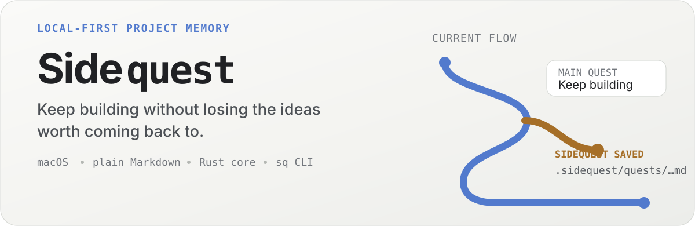
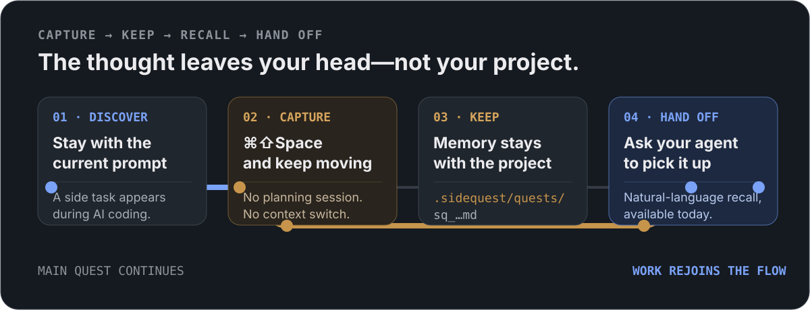
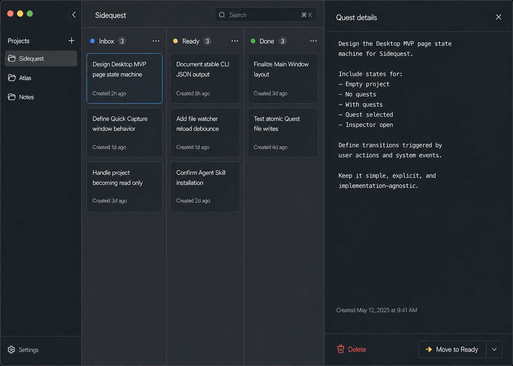

<p align="right">
  <strong>English</strong> · <a href="./README.zh-CN.md">简体中文</a>
</p>

<p align="center">
  <picture>
    <source media="(prefers-color-scheme: dark)" srcset="./assets/readme/hero-dark.svg">
    
  </picture>
</p>

<p align="center">
  <a href="#capture-it-now-pick-it-up-later">Why Sidequest</a> ·
  <a href="#one-project-memory-every-interface">How it works</a> ·
  <a href="#get-started">Get started</a> ·
  <a href="#command-line">CLI</a> ·
  <a href="./docs/README.md">Docs</a>
</p>

## Capture it now. Pick it up later.

AI coding constantly reveals work that matters but does not belong in the current prompt: a refactor, an edge case, a UX improvement, or something worth validating later.

Following it now derails the main goal. Leaving it in chat makes it hard to find in another session. Sidequest gives it a project-native place to wait.

1. Press <kbd>⌘</kbd><kbd>⇧</kbd><kbd>Space</kbd> from any app.
2. Capture the thought without stopping to organize it.
3. When the time is right, ask your coding agent to find the Quest and pick it up.

```text
Today
  "Quest details should support keyboard navigation."
  → saved to this project

Later, in a coding session
  You: Find the keyboard-navigation Sidequest and implement it.
  Agent: Found it. I'll inspect the Quest details flow first.
```

Natural-language recall is available today through the managed Codex and Claude skills. Sidequest gives agents a stable way to find and manage project memory; it does not schedule agents or execute Quests automatically.

<p align="center">
  
</p>

## See the project, not another task manager



Sidequest is deliberately scoped to project-level development intent:

- **Capture without context switching.** Quick Capture stays above the current app, saves in seconds, and returns focus to the work already in progress.
- **Re-evaluate when ready.** Browse and search Quests in the current project, then move them through `Inbox`, `Ready`, and `Done`.
- **Hand work back to an agent.** Installed Codex or Claude skills can recall and manage Quests from natural-language requests.
- **Keep ownership of the memory.** Every Quest is plain Markdown on your filesystem—no account, database, daemon, or cloud dependency.

Sidequest is for individual developers working in local code projects. It is intentionally not a team issue tracker or a general-purpose to-do app.

## One project memory, every interface

Quick Capture, the desktop app, the `sq` CLI, and coding-agent skills all go through the same Rust core. Storage, validation, workspace resolution, search, and safe writes therefore have one implementation and one source of truth.

For you, the agent interaction stays natural:

```text
"Show me the Sidequests about keyboard navigation."
"Pick up the accessibility Quest."
"Mark that Quest as done."
```

Underneath, the installed skill uses the versioned machine-readable CLI instead of reading hidden files or calling a private service:

```bash
sq --json search "keyboard navigation"
sq --json show sq_01KABC1234567890ABCDEFGHJK
sq --json status sq_01KABC1234567890ABCDEFGHJK done
```

The [`sq` CLI contract](./docs/contracts/cli.md) defines the stable arguments, JSON shapes, errors, and exit codes used by scripts and coding agents.

### Files are the source of truth

Each Quest is one readable file inside the project it belongs to:

```text
your-project/
└── .sidequest/
    └── quests/
        └── sq_01KABC1234567890ABCDEFGHJK.md
```

```markdown
---
created_at: 2026-08-22T22:30:00+08:00
status: inbox
---

Quest details should support keyboard navigation.
```

The files are portable, inspectable, easy to back up, and Git-friendly when you choose to version them. Sidequest never runs `git add`, `git commit`, or `git push` for you.

## What is included

- Multi-project macOS desktop app
- Global, always-on-top Quick Capture window
- `Inbox`, `Ready`, and `Done` Quest board
- Current-project search and editable Quest details
- Project-local Markdown storage with safe atomic writes
- Malformed-file isolation so one damaged Quest cannot block a workspace
- Native `sq` CLI with human-readable and stable JSON output
- Desktop-managed Codex and Claude skill integrations

## Get started

> **Early macOS MVP:** GitHub prereleases are community builds with ad-hoc code signing and no Apple notarization. Automatic updates are not available yet.

For a packaged build, download the DMG matching your Mac from [GitHub Releases](https://github.com/Xuuuu51/Sidequest/releases): `aarch64` for Apple Silicon or `x64` for Intel. Drag Sidequest to Applications and try to open it once. If macOS blocks it, open **System Settings → Privacy & Security** and choose **Open Anyway**.

Release assets include `SHA256SUMS.txt` so you can verify the downloaded DMG before opening it.

### Prerequisites

- macOS with the Xcode command-line toolchain
- Node.js 24
- pnpm 11.7 or later in the 11.x line
- Rust 1.98.0

Clone the repository and launch the Tauri desktop app:

```bash
git clone https://github.com/Xuuuu51/Sidequest.git
cd Sidequest
pnpm install
pnpm desktop
```

On first run, add a project and choose whether to configure Quick Capture and coding-agent integrations. The app can install its bundled `sq` CLI and managed Codex or Claude skill for you.

## Command line

To use the CLI independently of the desktop app, install it through Cargo:

```bash
cargo install --path crates/cli
```

Then initialize a project and capture your first Quest:

```bash
sq init /path/to/project
cd /path/to/project

sq add "Handle the read-only workspace state"
sq list
sq search "workspace"
```

```text
sq init      Initialize a Sidequest workspace
sq add       Capture a new Quest
sq list      List active Quests
sq show      Show one Quest
sq search    Search the current project
sq update    Edit Quest content
sq status    Move a Quest between states
sq delete    Delete one Quest
```

Use `sq --json <COMMAND>` for the versioned machine-readable interface used by scripts and coding agents.

## Scope

The MVP deliberately stays small. It does not include Windows or Linux apps, cloud sync, team collaboration, external issue-tracker integrations, semantic search, automatic Quest execution, or automatic detection of the project behind the current IDE, terminal, or chat.

See the [MVP scope](./docs/product/mvp-scope.md) for the exact product boundary and the [documentation map](./docs/README.md) for product, contracts, architecture, desktop behavior, and delivery guidance.

## Development

| Area | Technology |
| --- | --- |
| Core | Rust |
| CLI | Rust + clap |
| Desktop | Tauri 2 + React + TypeScript |
| Server state | TanStack Query |
| UI state | Zustand |
| Storage | Markdown + YAML frontmatter |

Run the desktop app during development:

```bash
pnpm install
pnpm desktop
```

Run the common checks from the workspace root:

```bash
pnpm format:check
cargo clippy --workspace
cargo test --workspace
pnpm lint
pnpm typecheck
pnpm test
```

Start with the [documentation map](./docs/README.md). The [architecture overview](./docs/architecture/overview.md), [stable contracts](./docs/contracts/), and [acceptance checklist](./docs/delivery/acceptance.md) cover implementation boundaries and the complete delivery gate.

## License

Sidequest is available under the [MIT License](./LICENSE).
