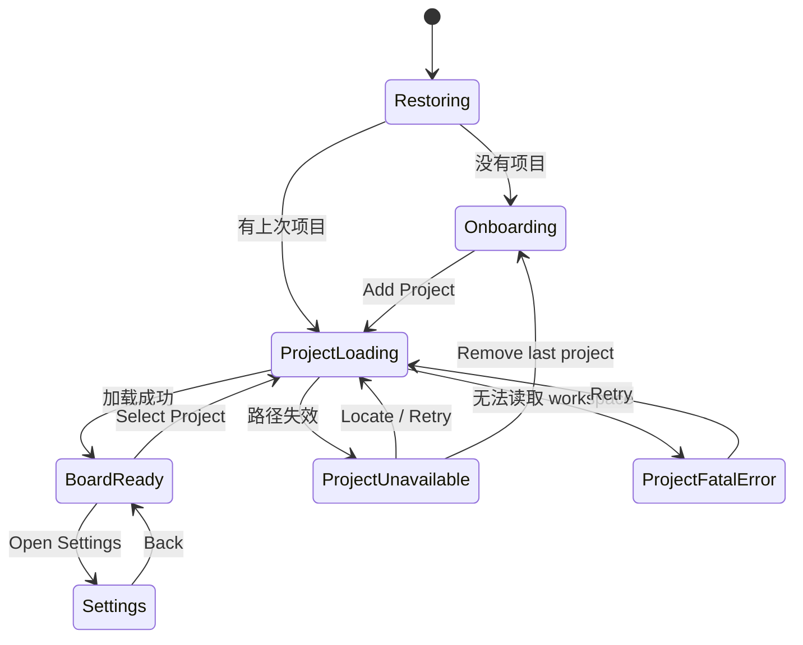
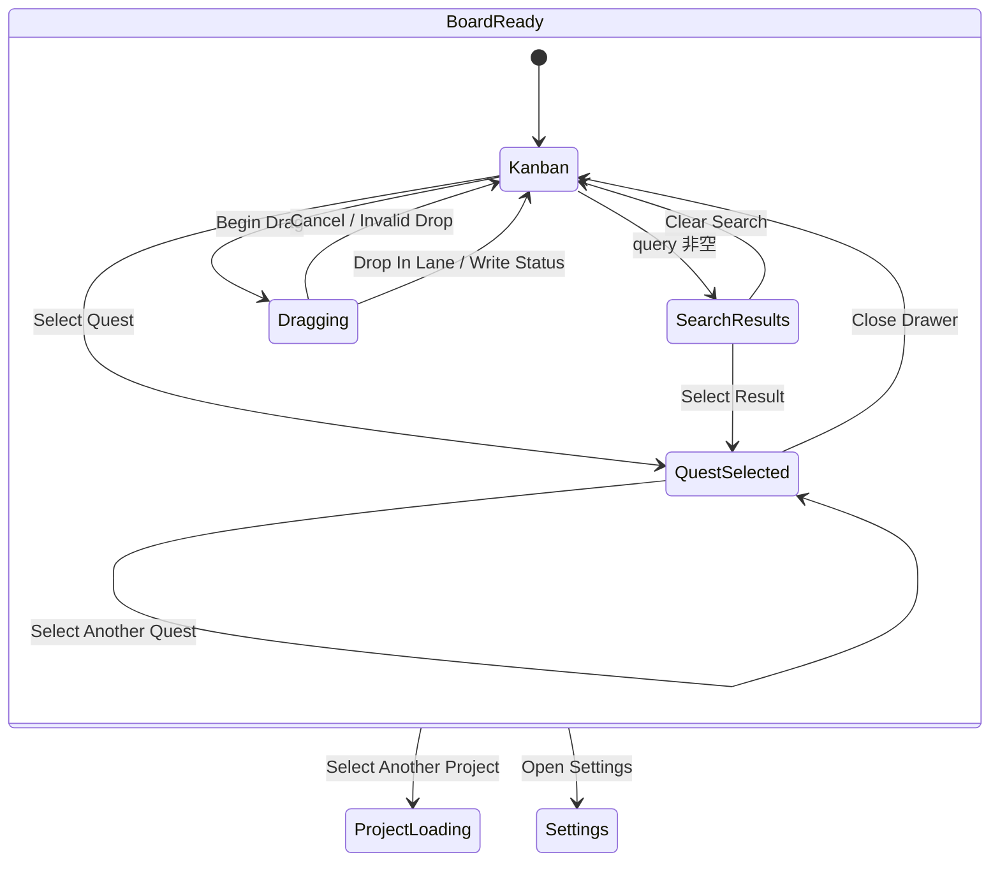
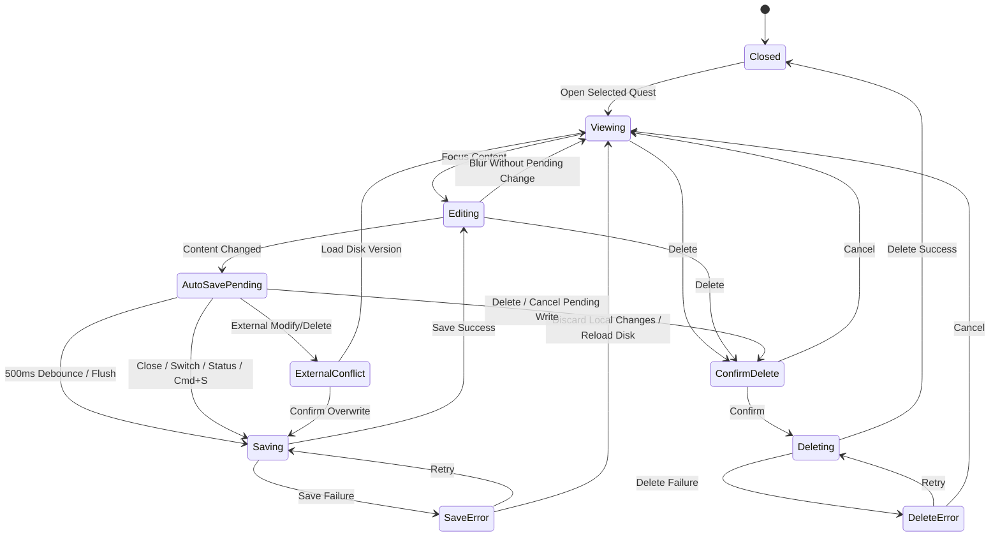
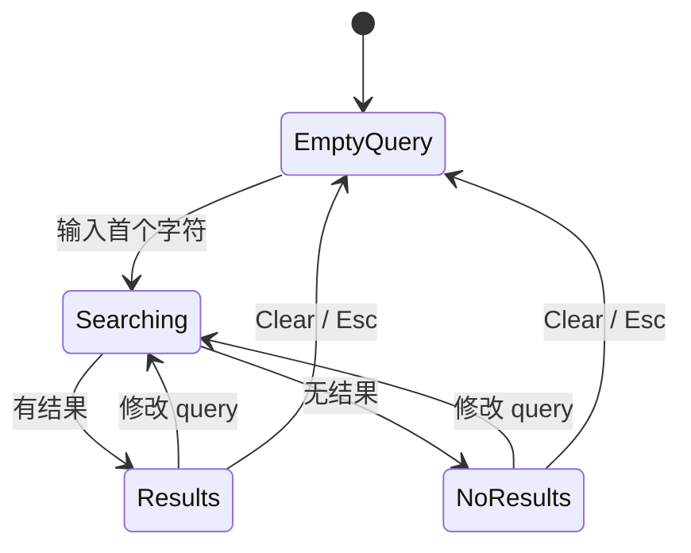
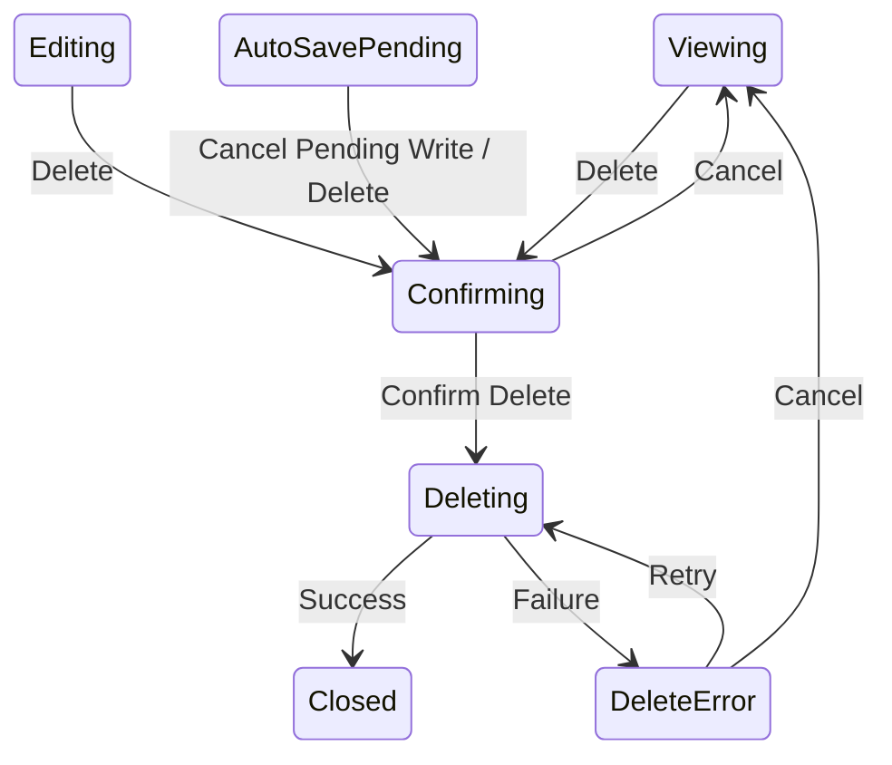

# Desktop Main Window 交互状态机

> 状态：实现基线  
> 日期：2026-08-23  
> 视觉基线：[Desktop Application Shell 与 Design System](./design-system.md)  
> 主窗口参考图：[Main Window v6](../assets/sidequest-application-shell-dark-v6.png)

## 1. 目标与边界

本文定义 Main Window 的 UI 状态、事件、转换、离开保护和异常反馈。它不改变 [Quest Data Contract](../contracts/quest-storage.md)，也不向 Quest 增加字段。

必须区分两类状态：

- Domain status：`inbox | ready | done`，写入 Quest 文件。
- UI state：当前项目、搜索、选择、Drawer、待自动保存内容、拖拽、确认框和提示，只存在于 Desktop 状态或 React 内存中。

不要把所有 UI 状态合并为一个巨大枚举。Main Window 使用多个相互约束的正交状态区。

## 2. 顶层页面状态



说明：

- 单个损坏 Quest 文件不是 `ProjectFatalError`，它只产生非阻塞 warning banner。
- Read Only 仍属于 `BoardReady`，通过 workspace capability 限制写操作。
- Settings 是 Main Window 内的页面状态，不创建新窗口。

## 3. 正交状态模型

```text
MainWindowUI
├─ route
│  ├─ onboarding
│  ├─ board
│  └─ settings
├─ workspace
│  ├─ restoring
│  ├─ loading
│  ├─ writable
│  ├─ readOnly
│  ├─ unavailable
│  └─ fatalError
├─ presentation
│  ├─ kanban
│  └─ searchResults(query)
├─ selection
│  ├─ none
│  └─ quest(id)
├─ drawer
│  ├─ closed
│  ├─ viewing
│  ├─ editing
│  ├─ autoSavePending
│  ├─ saving
│  ├─ saveError
│  └─ externalConflict
├─ drag
│  ├─ idle
│  └─ dragging(id, fromStatus)
├─ statusMenu
│  ├─ closed
│  └─ open
├─ deletion
│  ├─ idle
│  ├─ confirming
│  ├─ deleting
│  └─ deleteError
└─ feedback
   ├─ none
   ├─ toast
   └─ banner
```

## 4. Main Window 主状态流



`Close Drawer` 只关闭 Drawer，不清除 `selection.quest(id)`；看板中的卡片继续保持 selected 样式。再次点击同一卡片重新打开 Drawer。

## 5. Quest Details Drawer 状态机



### 5.1 Drawer Action Bar

Drawer rest 状态：

```text
左侧：Delete
右侧：Status Split Button
```

规则：

- Content 修改后进入 `autoSavePending`，最后一次输入后 `500ms` 自动保存。
- 待保存与保存期间，Action Bar 保持 Delete + Status Split Button，不显示 Save、Cancel 或离开确认。
- Created metadata 行右侧依次显示 `Saving…` 和短暂的 `Saved`；反馈不得改变布局。
- 实际写入进行期间 split button 保持可见但暂时禁用；pending 阶段点击状态动作会先触发立即 flush。
- `⌘S` 只用于立即 flush 当前 pending 内容，不显示保存确认。
- Close Drawer、切换 Quest、切换项目、进入 Settings、关闭窗口或执行状态修改时，立即 flush pending 内容；成功后自动继续原始动作。
- `saveError` 保留本地内容，在 Action Bar 上方显示 Retry 和 Discard Local Changes；错误未处理前阻止离开。
- Read Only 时正文不可编辑，Delete 与状态按钮禁用；仍允许选择和复制正文。

### 5.2 状态 Split Button

| 当前状态 | 主按钮 | 菜单项 |
|---|---|---|
| Inbox | `Move to Ready` | `Mark Done` |
| Ready | `Mark Done` | `Move to Inbox` |
| Done | `Move to Ready` | `Move to Inbox` |

转换规则：

- `viewing` 或无 pending 内容的 `editing` 状态下点击后立即调用 Core 写入 status。
- 如果存在 `autoSavePending`，先 flush content；只有保存成功才继续写入 status。
- 写入期间禁用 split button，并在按钮内显示小型 progress。
- 成功后 Quest 移动到目标列，Drawer 保持打开，selection 保持同一个 ID。
- 失败时 Quest 留在原列，Drawer 保持打开，并在 Action Bar 上方显示可重试错误。
- 菜单打开时按 `Esc` 只关闭菜单，不关闭 Drawer。
- Done 没有后续状态，主按钮使用最常用的恢复动作 `Move to Ready`。

## 6. 拖拽状态

| 当前条件 | 行为 |
|---|---|
| Writable + 无 pending/save operation | 允许拖拽 |
| Read Only | 禁止拖拽 |
| 选中 Quest 正在 pending、saving 或 saveError | 禁止拖拽该 Quest |
| Drop 回原列 | 不写文件，恢复原位 |
| Drop 到新列 | 调用 Core 修改 status |
| 写入成功 | 按目标列排序规则重新定位 |
| 写入失败 | 回到原列并显示错误 toast |

拖拽视觉：

- 原卡片保留低透明度占位。
- 目标位置显示 `2px` insertion indicator。
- 卡片不旋转、不缩放，不使用弹跳动画。
- 按 `Esc` 取消拖拽。

## 7. 搜索状态



规则：

- Empty query 显示三列 Kanban。
- 非空 query 显示当前项目的单列实时结果。
- 搜索是本地 substring match，不显示远程 loading skeleton。
- 清除搜索恢复三个 Lane 之前的独立滚动位置。
- 搜索过程中已打开的 Drawer 保持打开，即使当前 Quest 不再匹配 query。
- 选择搜索结果后打开同一个 Quest Details Drawer。
- 损坏 Quest 不进入结果，但 warning banner 仍显示。

## 8. Workspace 与文件异常状态

### 8.1 Loading

- 保留 Application Shell 和 Sidebar，Board 显示低干扰 progress。
- 不使用成组 skeleton cards。
- 项目切换时旧项目内容立即不可操作，避免误写旧 workspace。

### 8.2 Empty Project

- 保留三个 Lane header。
- Inbox 显示产品定义的主要空状态文案；Ready、Done 使用更弱的单行 empty label。

### 8.3 Read Only

- Board 顶部显示 persistent compact banner。
- 允许浏览、搜索、选择和复制。
- 禁止编辑、删除、拖拽、状态修改和 Quick Capture 保存。
- 所有禁用操作提供原因 tooltip：`Project is read-only`。

### 8.4 Unavailable

- Sidebar 保留项目行并显示 warning icon。
- Board 不显示缓存 Quest，改为 unavailable state。
- 提供 `Locate Folder`、`Retry` 和项目菜单中的 `Remove Project`。
- 不自动向上解析或切换到其他目录。

### 8.5 Corrupt Quest Files

- 有效 Quest 正常加载。
- Board 顶部显示：`N quest files could not be read · View Details`。
- Details 列出文件路径并提供 Reveal in Finder。
- 不自动修复、覆盖或删除损坏文件。

### 8.6 Fatal Workspace Error

- 只用于 `.sidequest/` 整体无法读取等阻塞错误。
- Board 显示错误原因、`Retry` 和 `Reveal in Finder`。
- Sidebar 与项目管理仍可使用。

## 9. 删除流程



- 确认框显示最多三行 content 摘要。
- 明确说明对应 Markdown 文件将删除，且 MVP 无应用内撤销。
- 如果仍有短暂 pending 内容，打开确认框前取消 pending write；确认框说明最近输入也会随 Quest 一并删除。
- 删除成功关闭 Drawer、保留其他卡片位置、不自动选择下一张，并显示 `Quest deleted`。

## 10. 自动保存与离开行为

| 用户动作 | 无 pending 内容 | Auto-save pending / saving | Save error |
|---|---|---|---|
| Close Drawer | 直接关闭 | 立即 flush，成功后关闭 | 阻止离开并显示恢复操作 |
| Select Another Quest | 直接切换 | 立即 flush，成功后切换 | 阻止离开并显示恢复操作 |
| Select Project | 直接加载 | 立即 flush，成功后加载 | 阻止离开并显示恢复操作 |
| Open Settings | 直接进入 | 立即 flush，成功后进入 | 阻止离开并显示恢复操作 |
| Close Main Window | 直接隐藏 | 立即 flush，成功后隐藏 | 阻止隐藏并显示恢复操作 |
| Quit App | 直接退出 | 立即 flush，成功后退出 | 显示系统级失败恢复确认 |

正常保存不显示 Save confirmation，也不要求用户再次执行原始动作。

Save error 恢复操作：

```text
Retry
Discard Local Changes
Cancel Current Navigation
```

只有实际写入失败时才允许出现数据丢失确认。

## 11. 事件优先级与不变量

优先级从高到低：

1. 删除确认与系统级确认框。
2. Save error / External conflict。
3. Saving / status writing / deleting。
4. Auto-save pending flush。
5. Dragging。
6. 普通 selection、search 和 navigation。

不变量：

- `drawer != closed` 时必须存在 `selection.quest(id)`。
- `autoSavePending`、`saving` 或 `saveError` 时不得拖拽同一个 Quest。
- `workspace != writable` 时不得触发任何写操作。
- 同一 Quest 同一时刻只允许一个 write operation。
- status 写入、content 保存和删除都必须通过 Tauri Command 调用 `sidequest-core`。
- 文件 watcher 事件只触发 debounce + reload，不直接推导增量状态。
- UI 不展示 Quest ID，但内部 selection 与命令仍使用 ID。
